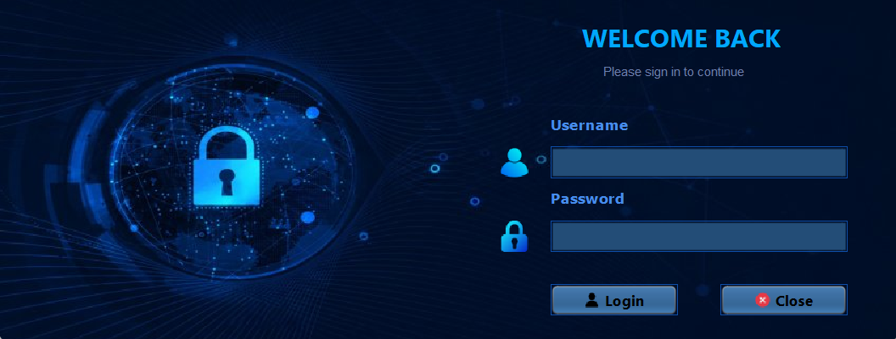
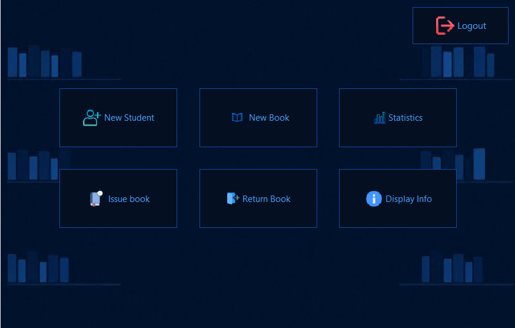
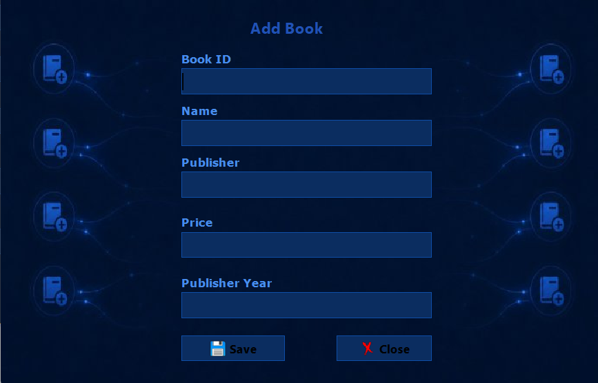
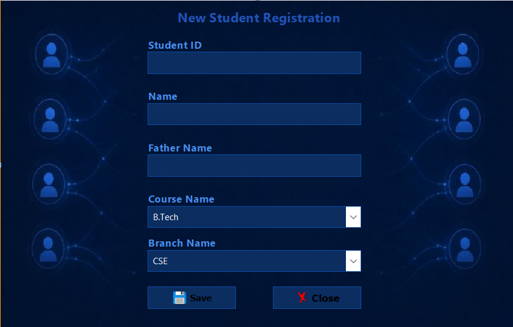
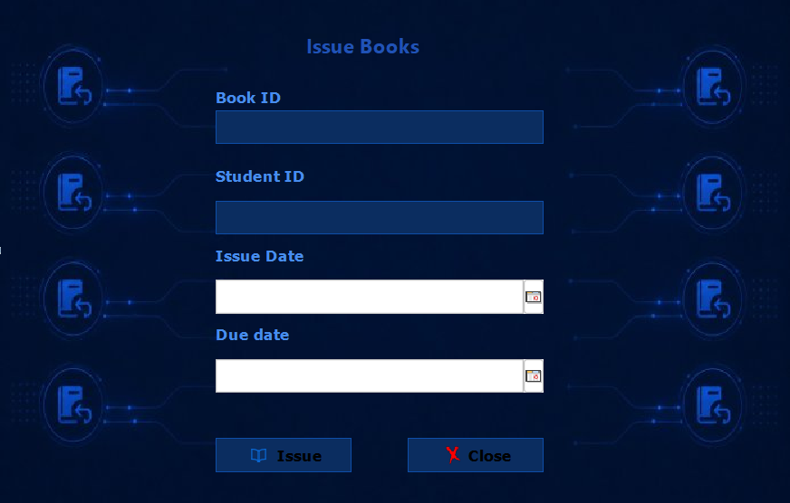
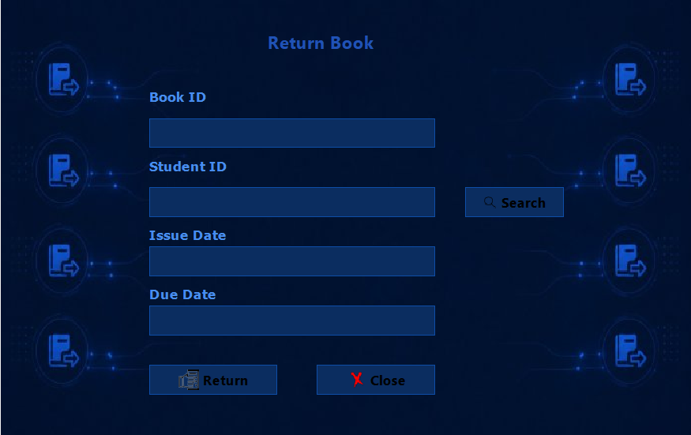
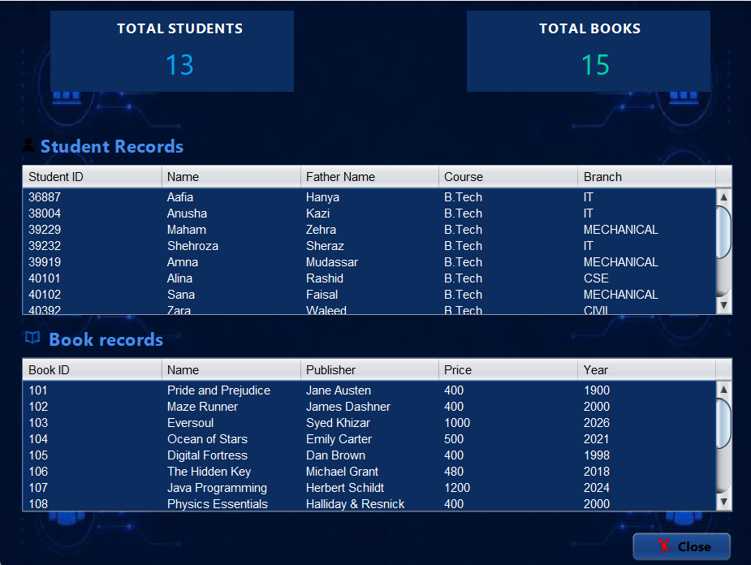
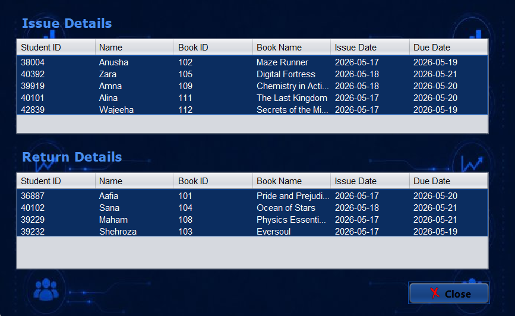

# 📚 Library Management System

A desktop-based **Library Management System** developed using **Java Swing**, **JDBC**, and **MySQL**. This application provides a user-friendly graphical interface that allows librarians to efficiently manage books, students, and library transactions.

---

## 🌟 Project Overview

Library Management System is a desktop application developed using Java Swing, JDBC, and MySQL. It enables librarians to efficiently manage books, students, and borrowing records through an intuitive graphical user interface. The system streamlines common library operations such as issuing and returning books while maintaining accurate records.

This project was developed as part of our Object-Oriented Programming course using Java Swing for the graphical interface and MySQL as the backend database.

---

## ✨ Features

- 🔐 Secure Login System
- 📚 Add, Update & Delete Books
- 👨‍🎓 Add, Update & Delete Students
- 📕 Issue Books
- 📗 Return Books
- 📊 Dashboard displaying library statistics
- 🔍 Search Books and Students
- 💾 MySQL Database Connectivity using JDBC
- 🖥️ User-Friendly Java Swing Interface

---

## 🛠️ Technologies Used

| Technology | Purpose |
|------------|---------|
| Java | Programming Language |
| Java Swing | GUI Development |
| JDBC | Database Connectivity |
| MySQL | Database Management |
| NetBeans IDE | Development Environment |

---

## 📂 Project Structure

```text
Library-Management-System
│
├── src/
├── nbproject/
├── build.xml
├── manifest.mf
├── screenshots/
└── README.md
```

---

## 🗄️ Database

The application uses **MySQL** as its backend database.

Example tables include:

- Users
- Books
- Students
- Issued Books
- Returned Books

> **Note:** Before running the project, update the MySQL username and password in the source code according to your local database configuration.

---

## ▶️ Installation & Setup

1. Clone this repository.

```bash
git clone https://github.com/Shehrozashiraz/Library-Management-System.git
```

2. Open the project in **NetBeans IDE**.

3. Create the required MySQL database.

4. Import the SQL database (if provided).

5. Update the database username and password in the project.

6. Build and run the project.

---

## 📸 Application Screenshots

### 🔐 Login Page
The secure login screen where users authenticate before accessing the system.



---

### 🏠 Home Dashboard
The main dashboard that provides quick access to all library management features.



---

### 📚 Add Book
Allows librarians to add new books to the library database.



---

### 👨‍🎓 Add Student
Used to register new students in the library management system.



---

### 📖 Issue Book
Enables books to be issued to students while maintaining transaction records.



---

### 📥 Return Book
Allows librarians to record returned books and update the database.



---

### 📚 Books & Students Overview
Displays the total number of books and registered students in the library.



---

### 📊 Library Statistics
Provides an overview of issued books, returned books, and other important library statistics.



---

## 🚀 Future Improvements

- Password Encryption
- Role-Based Access Control
- Barcode Scanner Integration
- Email Notifications
- Fine Calculation System
- Online Book Reservation
- Report Generation (PDF/Excel)

---

## 👩‍💻 Author

**Shehroza Shiraz**

---

## 📄 License

This project was developed for **academic and learning purposes**.

---

## ⭐ Support

If you found this project helpful, consider giving it a ⭐ on GitHub!

